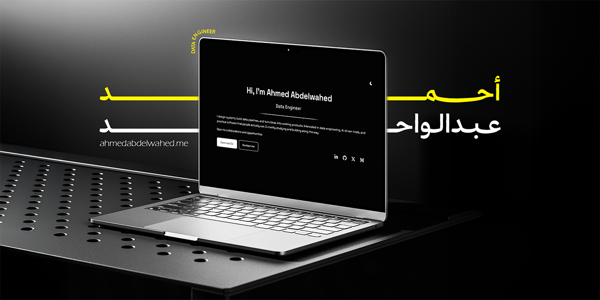

# Ahmed Abdelwahed | Personal Website

My personal portfolio website showcasing my background, experience, projects, and blog posts in Data Engineering and Software Development.

**Live at:** [ahmedabdelwahed.me](https://ahmedabdelwahed.me/)

## Tech Stack

- **Framework:** [Next.js](https://nextjs.org/) (App Router, static export)
- **Language:** [TypeScript](https://www.typescriptlang.org/)
- **Styling:** Vanilla CSS with custom design tokens
- **Animations:** [Framer Motion](https://www.framer.com/motion/)
- **Content:** Markdown/MDX (via `remark` & `rehype`) and local JSON files
- **Theming:** Light/dark mode via `next-themes`
- **Hosting:** [Netlify](https://www.netlify.com/)

## Features

- Responsive layout across mobile, tablet, and desktop
- Blog with Markdown authoring, syntax highlighting, and reading progress
- Dynamic content sections generated from `content/` directory
- Light/dark theme toggle
- SEO optimized (sitemap, robots.txt, Open Graph, JSON-LD)
- Smooth micro-animations with Framer Motion

## Contact

- **Email:** ahmedshehatasaid1@gmail.com
- **LinkedIn:** [ahmed-abdelwahed](https://linkedin.com/in/ahmed-abdelwahed)
- **GitHub:** [ahmed-abdelwahed1](https://github.com/ahmed-abdelwahed1)
- **X:** [@BinShehata](https://x.com/BinShehata)
