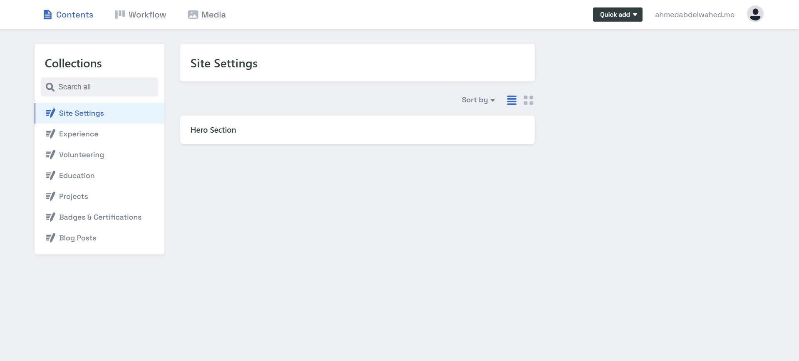

# Ahmed Abdelwahed | Personal Website

Production-ready personal portfolio and technical blog focused on Data Engineering and Software Development.

Live URL: [ahmedabdelwahed.me](https://ahmedabdelwahed.me/)

## Overview

This project is built with Next.js App Router and TypeScript, with content sourced from local JSON and Markdown files. It is optimized for performance, SEO, and maintainability.

## Core Features

- Responsive, mobile-first layout
- Blog with Markdown authoring, syntax highlighting, and reading progress
- Content-driven sections powered by files in the content directory
- Accessible light and dark theme toggle
- SEO support with sitemap, robots metadata, Open Graph, and JSON-LD
- Motion-enhanced interactions using Framer Motion

## Dashboard Preview

## Tech Stack

- Framework: [Next.js](https://nextjs.org/) (App Router)
- Language: [TypeScript](https://www.typescriptlang.org/)
- UI Styling: Vanilla CSS with custom design tokens
- Animations: [Framer Motion](https://www.framer.com/motion/)
- Content: Markdown with remark plugins and local JSON
- Theming: [next-themes](https://github.com/pacocoursey/next-themes)
- Deployment: [Netlify](https://www.netlify.com/)

## Architecture Diagram

```mermaid
flowchart TD

subgraph group_group_app["App Router"]
  node_node_layout["Layout<br/>Next shell<br/>[layout.tsx]"]
  node_node_home["Homepage<br/>route<br/>[page.tsx]"]
  node_node_blog_index["Blog Index<br/>route<br/>[page.tsx]"]
  node_node_blog_post["Blog Post<br/>dynamic route<br/>[page.tsx]"]
  node_node_seo["SEO<br/>structured data<br/>[robots.ts]"]
end

subgraph group_group_content["Content"]
  node_node_content_lib["Content Lib<br/>data access<br/>[content.ts]"]
  node_node_blog_lib["Blog Lib<br/>markdown pipeline<br/>[blog.ts]"]
  node_node_site_data["Site Data<br/>json content<br/>[hero.json]"]
  node_node_experience_data["Experience<br/>json content<br/>[cyan-group.json]"]
  node_node_projects_data["Projects<br/>json content<br/>[stocks-etl.json]"]
  node_node_education_data["Education<br/>json content<br/>[bachelors.json]"]
  node_node_badges_data["Badges<br/>json content"]
  node_node_volunteer_data["Volunteering<br/>json content<br/>[ieee.json]"]
  node_node_blog_content["Blog Posts<br/>markdown content"]
end

subgraph group_group_components["Components"]
  node_node_hero["Hero<br/>section<br/>[Hero.tsx]"]
  node_node_sections["Sections<br/>presentation"]
  node_node_motion["Motion UI<br/>interaction layer"]
  node_node_theme["Theme<br/>client state<br/>[ThemeProvider.tsx]"]
end

subgraph group_group_public["Public Assets"]
  node_node_public["Static Assets<br/>public files<br/>[index.html]"]
end

subgraph group_group_ops["Ops"]
  node_node_build["Deploy Config<br/>hosting config<br/>[netlify.toml]"]
  node_node_ci["Lint CI<br/>workflow<br/>[lint.yml]"]
end

node_node_layout -->|"wraps"| node_node_theme
node_node_layout -->|"publishes"| node_node_seo
node_node_home -->|"renders"| node_node_hero
node_node_home -->|"composes"| node_node_sections
node_node_home -->|"loads"| node_node_content_lib
node_node_blog_index -->|"queries"| node_node_blog_lib
node_node_blog_post -->|"reads"| node_node_blog_lib
node_node_blog_post -->|"annotates"| node_node_seo
node_node_blog_lib -->|"parses"| node_node_blog_content
node_node_content_lib -->|"loads"| node_node_site_data
node_node_content_lib -->|"loads"| node_node_experience_data
node_node_content_lib -->|"loads"| node_node_projects_data
node_node_content_lib -->|"loads"| node_node_education_data
node_node_content_lib -->|"loads"| node_node_badges_data
node_node_content_lib -->|"loads"| node_node_volunteer_data
node_node_sections -->|"shows"| node_node_experience_data
node_node_sections -->|"shows"| node_node_projects_data
node_node_sections -->|"shows"| node_node_education_data
node_node_sections -->|"shows"| node_node_badges_data
node_node_sections -->|"shows"| node_node_volunteer_data
node_node_motion -->|"animates"| node_node_home
node_node_theme -->|"affects"| node_node_home
node_node_public -->|"serves"| node_node_layout
node_node_build -->|"targets"| node_node_layout
node_node_ci -->|"checks"| node_node_build

click node_node_layout "https://github.com/ahmed-abdelwahed1/personal-website/blob/main/src/app/layout.tsx"
click node_node_home "https://github.com/ahmed-abdelwahed1/personal-website/blob/main/src/app/page.tsx"
click node_node_blog_index "https://github.com/ahmed-abdelwahed1/personal-website/blob/main/src/app/blog/page.tsx"
click node_node_blog_post "https://github.com/ahmed-abdelwahed1/personal-website/blob/main/src/app/blog/[slug]/page.tsx"
click node_node_content_lib "https://github.com/ahmed-abdelwahed1/personal-website/blob/main/src/lib/content.ts"
click node_node_blog_lib "https://github.com/ahmed-abdelwahed1/personal-website/blob/main/src/lib/blog.ts"
click node_node_site_data "https://github.com/ahmed-abdelwahed1/personal-website/blob/main/content/site/hero.json"
click node_node_experience_data "https://github.com/ahmed-abdelwahed1/personal-website/blob/main/content/experience/cyan-group.json"
click node_node_projects_data "https://github.com/ahmed-abdelwahed1/personal-website/blob/main/content/projects/stocks-etl.json"
click node_node_education_data "https://github.com/ahmed-abdelwahed1/personal-website/blob/main/content/education/bachelors.json"
click node_node_badges_data "https://github.com/ahmed-abdelwahed1/personal-website/blob/main/content/badges/data-analyst-ibm.json"
click node_node_volunteer_data "https://github.com/ahmed-abdelwahed1/personal-website/blob/main/content/volunteering/ieee.json"
click node_node_blog_content "https://github.com/ahmed-abdelwahed1/personal-website/blob/main/content/blog/building-etl-pipelines.md"
click node_node_hero "https://github.com/ahmed-abdelwahed1/personal-website/blob/main/src/components/Hero.tsx"
click node_node_sections "https://github.com/ahmed-abdelwahed1/personal-website/blob/main/src/components/ExperienceSection.tsx"
click node_node_motion "https://github.com/ahmed-abdelwahed1/personal-website/blob/main/src/components/AnimatedSection.tsx"
click node_node_theme "https://github.com/ahmed-abdelwahed1/personal-website/blob/main/src/components/ThemeProvider.tsx"
click node_node_seo "https://github.com/ahmed-abdelwahed1/personal-website/blob/main/src/app/robots.ts"
click node_node_public "https://github.com/ahmed-abdelwahed1/personal-website/blob/main/public/admin/index.html"
click node_node_build "https://github.com/ahmed-abdelwahed1/personal-website/blob/main/netlify.toml"
click node_node_ci "https://github.com/ahmed-abdelwahed1/personal-website/blob/main/.github/workflows/lint.yml"

classDef toneNeutral fill:#f8fafc,stroke:#334155,stroke-width:1.5px,color:#0f172a
classDef toneBlue fill:#dbeafe,stroke:#2563eb,stroke-width:1.5px,color:#172554
classDef toneAmber fill:#fef3c7,stroke:#d97706,stroke-width:1.5px,color:#78350f
classDef toneMint fill:#dcfce7,stroke:#16a34a,stroke-width:1.5px,color:#14532d
classDef toneRose fill:#ffe4e6,stroke:#e11d48,stroke-width:1.5px,color:#881337
classDef toneIndigo fill:#e0e7ff,stroke:#4f46e5,stroke-width:1.5px,color:#312e81
classDef toneTeal fill:#ccfbf1,stroke:#0f766e,stroke-width:1.5px,color:#134e4a
class node_node_layout,node_node_home,node_node_blog_index,node_node_blog_post,node_node_seo toneBlue
class node_node_content_lib,node_node_blog_lib,node_node_site_data,node_node_experience_data,node_node_projects_data,node_node_education_data,node_node_badges_data,node_node_volunteer_data,node_node_blog_content toneAmber
class node_node_hero,node_node_sections,node_node_motion,node_node_theme toneMint
class node_node_public toneRose
class node_node_build,node_node_ci toneIndigo
```

## Contact

- Email: <contact@ahmedabdelwahed.me>
- LinkedIn: [ahmed-abdelwahed](https://linkedin.com/in/ahmed-abdelwahed)
- GitHub: [ahmed-abdelwahed1](https://github.com/ahmed-abdelwahed1)
- X: [@BinShehata](https://x.com/BinShehata)

## License

This project is licensed under the MIT License. See the [LICENSE](LICENSE) file for details.
