# Ahmed Abdelwahed | Personal Website

Production-ready personal portfolio and technical blog focused on Data Engineering and Software Development.

Live URL: [ahmedabdelwahed.me](https://ahmedabdelwahed.me/)

## Overview

This project is built with Next.js App Router and TypeScript, with content sourced from local JSON and Markdown files. It is optimized for performance, SEO, and maintainability.

## Core Features

- Responsive, mobile-first layout
- Blog with Markdown authoring, syntax highlighting, and reading progress
- Content-driven sections powered by files in the content directory
- Accessible light and dark theme toggle
- SEO support with sitemap, robots metadata, Open Graph, and JSON-LD
- Motion-enhanced interactions using Framer Motion
- Agent-ready: AI agent discovery, content negotiation, and WebMCP tool exposure

## Dashboard Preview

## Tech Stack

- Framework: [Next.js](https://nextjs.org/) (App Router)
- Language: [TypeScript](https://www.typescriptlang.org/)
- UI Styling: Vanilla CSS with custom design tokens
- Animations: [Framer Motion](https://www.framer.com/motion/)
- Content: Markdown with remark plugins and local JSON
- Theming: [next-themes](https://github.com/pacocoursey/next-themes)
- Deployment: [Netlify](https://www.netlify.com/)

## Agent Readiness

This site implements the [IsAgentReady](https://isitagentready.com/) specification, making it fully discoverable and accessible to AI agents.

### Discovery Endpoints

| Endpoint | Purpose | Spec |
|----------|---------|------|
| `/.well-known/api-catalog` | API catalog for automated discovery | [RFC 9727](https://www.rfc-editor.org/rfc/rfc9727) |
| `/.well-known/agent-skills/index.json` | Agent skills discovery index | [Agent Skills Discovery v0.2.0](https://github.com/cloudflare/agent-skills-discovery-rfc) |
| `/.well-known/mcp/server-card.json` | MCP Server Card for agent discovery | [SEP-1649](https://github.com/modelcontextprotocol/modelcontextprotocol/pull/2127) |
| `/.well-known/openid-configuration` | OAuth/OIDC discovery metadata | [OpenID Connect Discovery](http://openid.net/specs/openid-connect-discovery-1_0.html) |
| `/.well-known/oauth-protected-resource` | OAuth Protected Resource metadata | [RFC 9728](https://www.rfc-editor.org/rfc/rfc9728) |

### Content Accessibility

- **Markdown Negotiation**: Requests with `Accept: text/markdown` return a markdown version of any HTML page via a Netlify Edge Function. Response includes `Content-Type: text/markdown` and `x-markdown-tokens` headers.
- **Content Signals**: `robots.txt` includes `Content-Signal: ai-train=no, search=yes, ai-input=no` per the [Content Signals](https://contentsignals.org/) specification.
- **Link Headers**: Homepage returns `Link` response headers (per [RFC 8288](https://www.rfc-editor.org/rfc/rfc8288)) pointing to `api-catalog`, `agent-skills`, and `sitemap.xml`.

### WebMCP Tools

The site exposes tools to AI agents via the browser using the [WebMCP API](https://webmachinelearning.github.io/webmcp/):

| Tool | Description |
|------|-------------|
| `navigate-to-section` | Scroll to a named section (hero, experience, projects, etc.) |
| `get-contact-info` | Extract public contact information and social links |
| `list-blog-posts` | List visible blog post titles, dates, and URLs |

## Architecture Diagram

```mermaid
flowchart TD

subgraph group_app["Next.js app"]
  node_layout["App shell<br/>Next layout<br/>[layout.tsx]"]
  node_home["Home page<br/>Route page<br/>[page.tsx]"]
  node_blog_index["Blog index<br/>Route page<br/>[page.tsx]"]
  node_blog_post["Post page<br/>Dynamic route<br/>[page.tsx]"]
  node_sitemap["Sitemap<br/>Metadata route<br/>[sitemap.ts]"]
  node_content_lib["Content loader<br/>Content adapter<br/>[content.ts]"]
  node_blog_lib["Blog loader<br/>Markdown parser<br/>[blog.ts]"]
end

subgraph group_components["UI components"]
  node_theme["Theme<br/>Client provider<br/>[ThemeProvider.tsx]"]
  node_hero["Hero<br/>Section component<br/>[Hero.tsx]"]
  node_experience["Experience<br/>Section component"]
  node_projects["Projects<br/>Section component"]
  node_education["Education<br/>Section component"]
  node_badges["Badges<br/>Section component<br/>[BadgesSection.tsx]"]
  node_volunteering["Volunteering<br/>Section component"]
  node_heatmap["GitHub heatmap<br/>Section component"]
  node_blog_ui["Blog UI<br/>Article components"]
  node_seo["SEO metadata<br/>Structured data<br/>[JsonLd.tsx]"]
  node_analytics["Analytics<br/>Client tracker<br/>[Analytics.tsx]"]
end

subgraph group_content["File content"]
  node_site_content["Profile JSON<br/>Content data<br/>[hero.json]"]
  node_blog_content["Blog markdown<br/>Post content"]
end

subgraph group_public["Public surface"]
  node_public_surface[("Public assets<br/>Static assets")]
  node_well_known["Well-known<br/>Discovery files<br/>[.well-known]"]
  node_admin["Admin CMS<br/>Static CMS"]
end

subgraph group_deploy["Deploy edge"]
  node_edge_md["Markdown edge<br/>Netlify edge"]
  node_netlify_cfg["Netlify config<br/>Hosting config<br/>[netlify.toml]"]
end

node_layout -->|"provides"| node_theme
node_layout -->|"loads"| node_analytics
node_layout -->|"hosts"| node_home
node_layout -->|"hosts"| node_blog_index
node_layout -->|"hosts"| node_blog_post
node_home -->|"reads"| node_content_lib
node_home -->|"renders"| node_hero
node_home -->|"renders"| node_experience
node_home -->|"renders"| node_projects
node_home -->|"renders"| node_education
node_home -->|"renders"| node_badges
node_home -->|"renders"| node_volunteering
node_home -->|"renders"| node_heatmap
node_content_lib -->|"loads"| node_site_content
node_blog_index -->|"reads"| node_blog_lib
node_blog_post -->|"reads"| node_blog_lib
node_blog_post -->|"uses"| node_blog_ui
node_blog_index -->|"uses"| node_seo
node_blog_post -->|"uses"| node_seo
node_blog_post -->|"sources"| node_blog_content
node_sitemap -->|"indexes"| node_public_surface
node_public_surface -->|"contains"| node_well_known
node_public_surface -->|"contains"| node_admin
node_admin -.->|"edits via"| node_content_lib
node_edge_md -->|"negotiates"| node_blog_lib
node_netlify_cfg -->|"enables"| node_edge_md
node_netlify_cfg -->|"serves"| node_public_surface

click node_layout "https://github.com/ahmed-abdelwahed1/personal-website/blob/main/src/app/layout.tsx"
click node_home "https://github.com/ahmed-abdelwahed1/personal-website/blob/main/src/app/page.tsx"
click node_blog_index "https://github.com/ahmed-abdelwahed1/personal-website/blob/main/src/app/blog/page.tsx"
click node_blog_post "https://github.com/ahmed-abdelwahed1/personal-website/blob/main/src/app/blog/[slug]/page.tsx"
click node_sitemap "https://github.com/ahmed-abdelwahed1/personal-website/blob/main/src/app/sitemap.ts"
click node_content_lib "https://github.com/ahmed-abdelwahed1/personal-website/blob/main/src/lib/content.ts"
click node_blog_lib "https://github.com/ahmed-abdelwahed1/personal-website/blob/main/src/lib/blog.ts"
click node_theme "https://github.com/ahmed-abdelwahed1/personal-website/blob/main/src/components/ThemeProvider.tsx"
click node_hero "https://github.com/ahmed-abdelwahed1/personal-website/blob/main/src/components/Hero.tsx"
click node_experience "https://github.com/ahmed-abdelwahed1/personal-website/blob/main/src/components/ExperienceSection.tsx"
click node_projects "https://github.com/ahmed-abdelwahed1/personal-website/blob/main/src/components/ProjectsSection.tsx"
click node_education "https://github.com/ahmed-abdelwahed1/personal-website/blob/main/src/components/EducationSection.tsx"
click node_badges "https://github.com/ahmed-abdelwahed1/personal-website/blob/main/src/components/BadgesSection.tsx"
click node_volunteering "https://github.com/ahmed-abdelwahed1/personal-website/blob/main/src/components/VolunteeringSection.tsx"
click node_heatmap "https://github.com/ahmed-abdelwahed1/personal-website/blob/main/src/components/GithubHeatmapSection.tsx"
click node_blog_ui "https://github.com/ahmed-abdelwahed1/personal-website/blob/main/src/components/ReadingProgress.tsx"
click node_seo "https://github.com/ahmed-abdelwahed1/personal-website/blob/main/src/components/JsonLd.tsx"
click node_analytics "https://github.com/ahmed-abdelwahed1/personal-website/blob/main/src/components/Analytics.tsx"
click node_site_content "https://github.com/ahmed-abdelwahed1/personal-website/blob/main/content/site/hero.json"
click node_blog_content "https://github.com/ahmed-abdelwahed1/personal-website/blob/main/content/blog/building-etl-pipelines.md"
click node_public_surface "https://github.com/ahmed-abdelwahed1/personal-website/tree/main/public"
click node_well_known "https://github.com/ahmed-abdelwahed1/personal-website/blob/main/public/.well-known"
click node_admin "https://github.com/ahmed-abdelwahed1/personal-website/tree/main/public/admin"
click node_edge_md "https://github.com/ahmed-abdelwahed1/personal-website/blob/main/netlify/edge-functions/markdown-negotiation.ts"
click node_netlify_cfg "https://github.com/ahmed-abdelwahed1/personal-website/blob/main/netlify.toml"

classDef toneNeutral fill:#f8fafc,stroke:#334155,stroke-width:1.5px,color:#0f172a
classDef toneBlue fill:#dbeafe,stroke:#2563eb,stroke-width:1.5px,color:#172554
classDef toneAmber fill:#fef3c7,stroke:#d97706,stroke-width:1.5px,color:#78350f
classDef toneMint fill:#dcfce7,stroke:#16a34a,stroke-width:1.5px,color:#14532d
classDef toneRose fill:#ffe4e6,stroke:#e11d48,stroke-width:1.5px,color:#881337
classDef toneIndigo fill:#e0e7ff,stroke:#4f46e5,stroke-width:1.5px,color:#312e81
classDef toneTeal fill:#ccfbf1,stroke:#0f766e,stroke-width:1.5px,color:#134e4a
class node_layout,node_home,node_blog_index,node_blog_post,node_sitemap,node_content_lib,node_blog_lib toneBlue
class node_theme,node_hero,node_experience,node_projects,node_education,node_badges,node_volunteering,node_heatmap,node_blog_ui,node_seo,node_analytics toneAmber
class node_site_content,node_blog_content toneMint
class node_public_surface,node_well_known,node_admin toneRose
class node_edge_md,node_netlify_cfg toneIndigo
```

## Contact

- Email: <contact@ahmedabdelwahed.me>
- LinkedIn: [ahmed-abdelwahed](https://linkedin.com/in/ahmed-abdelwahed)
- GitHub: [ahmed-abdelwahed1](https://github.com/ahmed-abdelwahed1)
- X: [@BinShehata](https://x.com/BinShehata)

## License

This project is licensed under the MIT License. See the [LICENSE](LICENSE) file for details.
